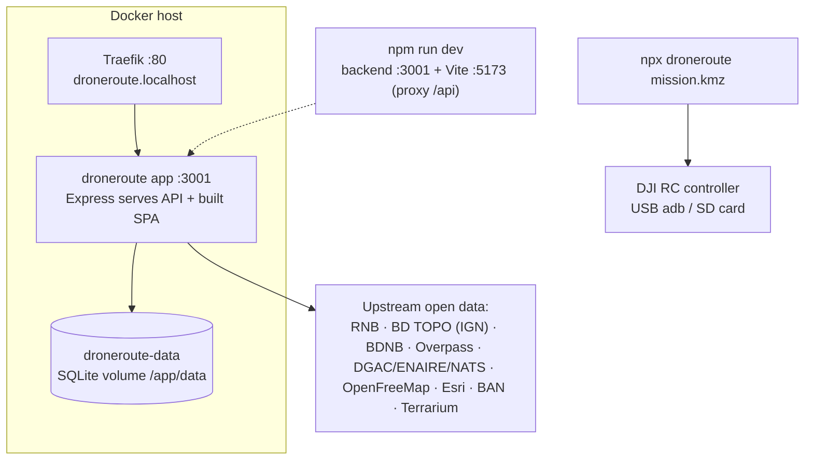
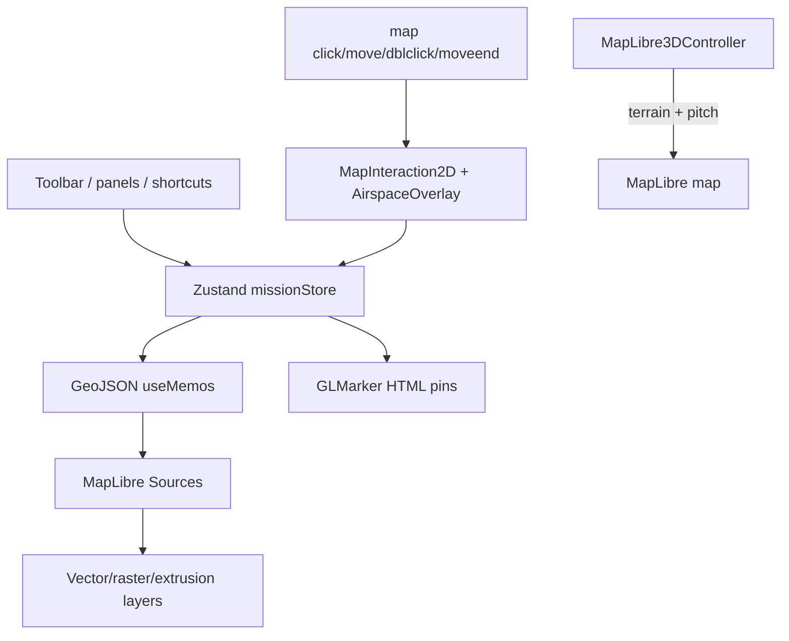
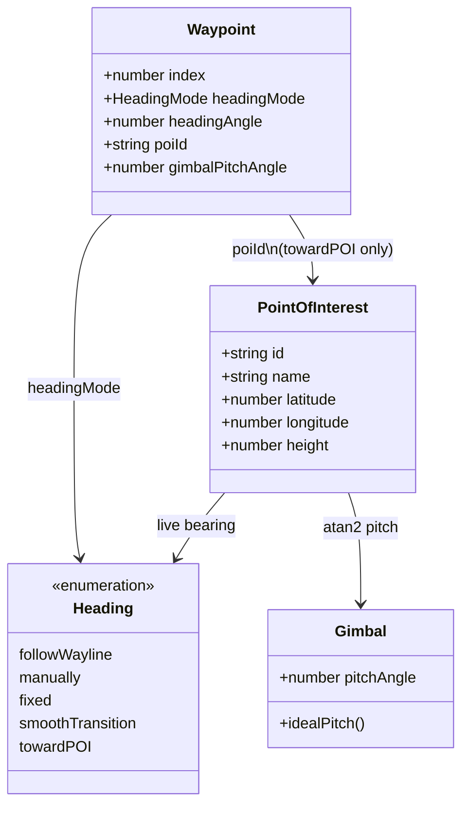
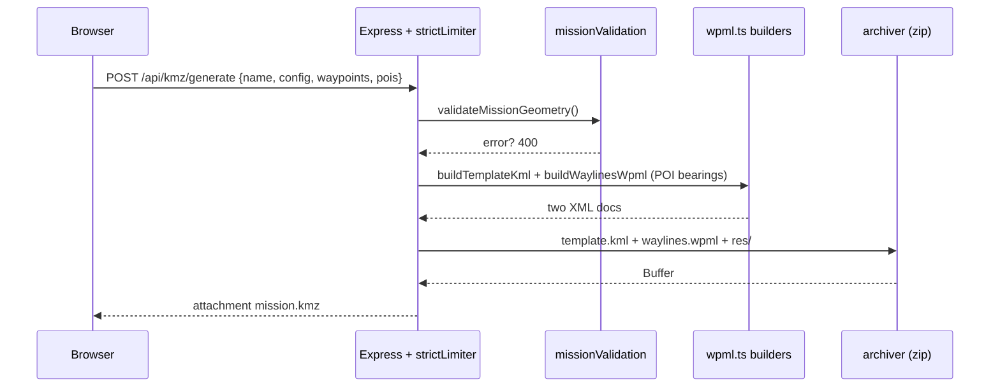
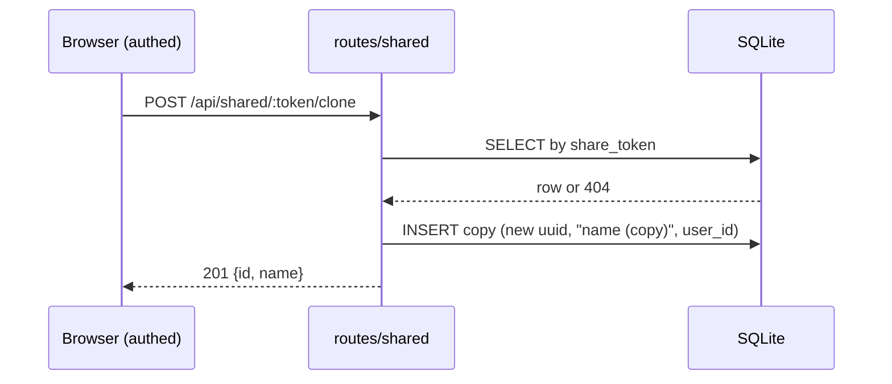
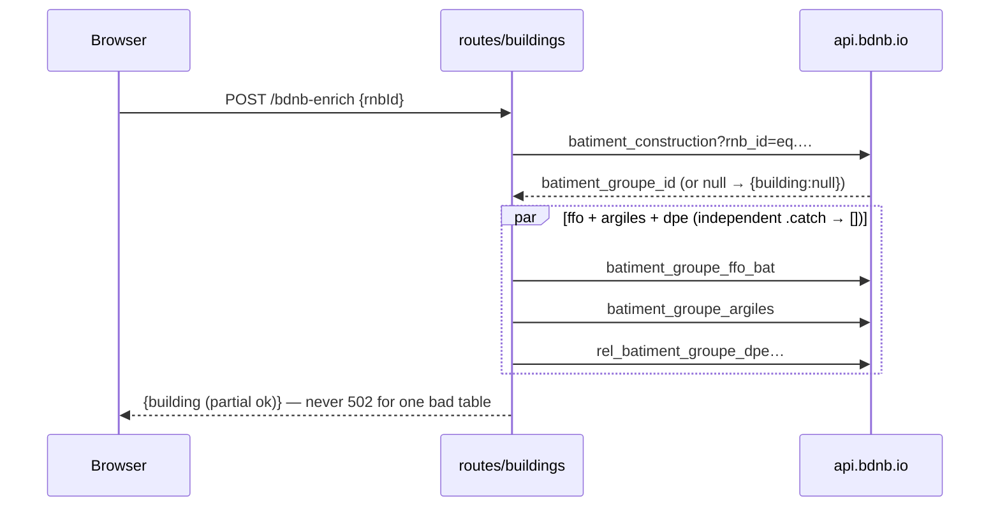
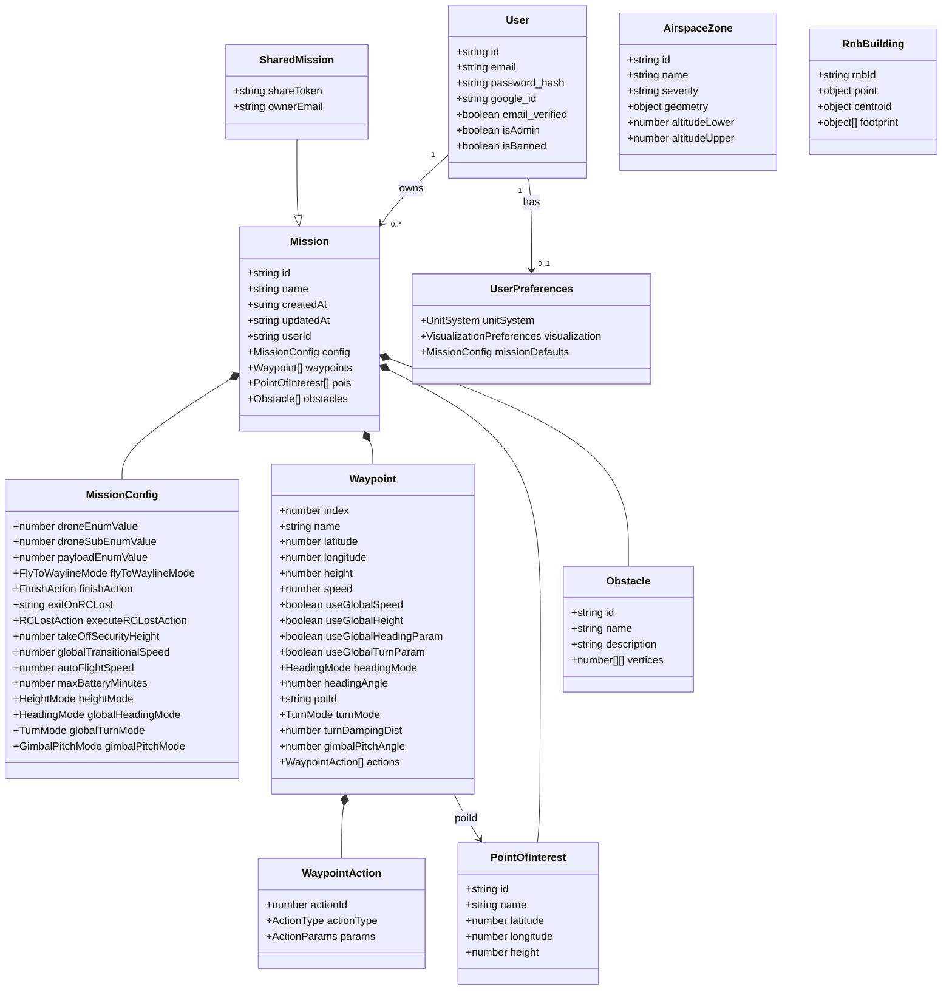

# DroneRoute — Architecture Analysis

> Reverse-engineered from the source tree (`packages/{shared,backend,frontend,cli}`, `e2e/`).
> Versions observed: frontend 0.7.1 / backend 0.7.1 / CLI 0.7.1, React 19, Vite 8,
> maplibre-gl 2.4.0, react-map-gl 8.1.1, Express 5, better-sqlite3 12, Node 22+.

---

## 1. Executive Summary

### What is the application?

DroneRoute is a free, open-source, self-hostable web application for planning DJI
drone waypoint missions on an interactive map and exporting them as DJI WPML-compliant
KMZ files ready to fly. A companion CLI uploads the KMZ directly to DJI RC controllers
over USB.

### Main purpose

Replace vendor-locked mission planners (DJI Pilot 2, DJI Fly) with an open tool that
covers the full loop: draw/inspect a mission on a keyless open-source map → configure
flight parameters → validate → export KMZ → push to controller → fly. Around that core
loop it adds persistence with user accounts, public share links, airspace restriction
overlays, French building-data workflows (RNB / BD TOPO / BDNB), mission templates, an
AI mission assistant, and an admin back office.

### End users

- Drone pilots and mission planners (mapping, inspection, agriculture,大了 image
  photogrammetry, facade surveys).
- Particularly French operators: RNB building registry, BD TOPO heights, BDNB energy
  data, DGAC airspace, BAN address search.
- Self-hosters wanting a private single-account instance (Docker + SQLite).

### Key workflows

1. **Plan → Export → Fly**: place waypoints/POIs/obstacles → tune config → KMZ →
   `npx droneroute mission.kmz` → DJI RC.
2. **Template-assisted planning**: orbit / grid / facade / pencil generators with live
   preview, then per-waypoint fine-tuning.
3. **Building inspection**: select RNB building → BD TOPO/BDNB enrichment → facade
   scan or 3D-reconstruction mission generation.
4. **Share & collaborate**: save → share link → public preview / clone / KMZ export.
5. **Compliance check**: airspace + obstacle warnings before flight; server-side
   geometry validation on every KMZ operation.

### Main technical domains involved

GIS rendering (MapLibre vector/raster/terrain), computational geometry (Haversine,
bearings, polygon intersection, frustum math), DJI WPML XML (generation + parsing),
SQLite persistence, JWT/OAuth auth, LLM-backed copilot, USB/ADB device upload,
E2E browser testing.

---

## 2. Application Architecture

### Stack inventory

| Concern            | Technology (version observed)                                                          | Where                                       |
| ------------------ | -------------------------------------------------------------------------------------- | ------------------------------------------- |
| Frontend           | React 19, TypeScript 6, Vite 8                                                         | `packages/frontend`                         |
| UI                 | shadcn/ui + Radix primitives, Tailwind CSS v4, lucide-react, sonner                    | `packages/frontend/src/components/ui`       |
| State              | Zustand 5 (5 stores, no middleware)                                                    | `packages/frontend/src/store/`              |
| Routing            | Custom state router (`currentPage`), no react-router                                   | `packages/frontend/src/App.tsx`             |
| Mapping engine     | MapLibre GL 2.4.0 via react-map-gl 8.1.1 (`react-map-gl/maplibre`)                     | `components/map/MapView.tsx`                |
| Basemaps (keyless) | OpenFreeMap `bright` vector (streets+buildings), Esri World Imagery, AWS Terrarium DEM | `MapView.tsx`, `reactMapOverlays.tsx`       |
| Geocoding          | BAN — Base Adresse Nationale (`api-adresse.data.gouv.fr`)                              | `MapView.tsx` (`MapSearch`)                 |
| Backend            | Node.js 22, Express 5, TypeScript, tsx (dev)                                           | `packages/backend`                          |
| Database           | SQLite via better-sqlite3 12 (`WAL` mode)                                              | `packages/backend/src/models/db.ts`         |
| Auth               | bcryptjs + jsonwebtoken (7-day JWT); google-auth-library (cloud OAuth)                 | `services/authService.ts`, `routes/auth.ts` |
| API style          | REST JSON (`/api/*`), multipart for KMZ upload, rate-limited                           | `packages/backend/src/routes/`              |
| Storage            | Local SQLite file (+ Docker volume); missions as JSON blobs in rows                    | `DB_PATH`, `droneroute-data` volume         |
| AI                 | Server-side: GitHub Models or any OpenAI-compatible chat endpoint                      | `services/assistantAi.ts`                   |
| CLI                | commander + inquirer + chalk, adb + filesystem probing                                 | `packages/cli`                              |
| Tests              | Vitest + supertest (unit/API), Playwright + Chromium (e2e)                             | `**/*.test.ts`, `e2e/smoke.spec.ts`         |
| Deploy             | Multi-stage Docker (Alpine), Traefik reverse proxy, fly.toml                           | `Dockerfile`, `docker-compose*.yml`         |

### Request pipeline (backend `packages/backend/src/index.ts`)

```mermaid
flowchart LR
    Client["Browser / CLI"] --> Proxy["Traefik / Vite proxy"]
    Proxy --> H1["1. trust proxy"]
    H1 --> H2["2. helmet (CSP/COEP off)"]
    H2 --> H3["3. cors (whitelist or same-origin)"]
    H3 --> H4["4. express.json 50mb"]
    H4 --> H5["5. globalLimiter 100/min"]
    H5 --> Static["static frontend/dist"]
    Static --> Routers["/api/auth, /missions, /kmz, /admin, /preferences, /airspace, /assistant, /buildings + /api share routes"]
    Routers --> Health["/api/health, /api/config"]
    Health --> SPA["GET /*splat → index.html"]
    SPA --> Err["errorHandler (no leak)"]
```



### Deployment topology



---

## 3. Feature Inventory

| Feature                         | Description                                                        | Components                                                                                 | Services                                       | Data                        |
| ------------------------------- | ------------------------------------------------------------------ | ------------------------------------------------------------------------------------------ | ---------------------------------------------- | --------------------------- |
| Mission editor                  | Interactive 2D/3D map, waypoint/POI/obstacle CRUD, sidebar editors | `MapView`, `MapToolbar`, `WaypointList/Editor`, `PoiList`, `ObstacleList`, `MissionConfig` | — (client) + `missionValidation` (server)      | `missions`                  |
| KMZ export/import               | Generate DJI-compliant KMZ; parse foreign KMZ back                 | `App` toolbar, `RoutesPage`                                                                | `kmzGenerator`, `kmzParser`, `lib/wpml`        | `missions`                  |
| Mission templates               | Orbit / grid / facade / pencil generators + live preview           | `TemplateConfigPanel`, `lib/templates`                                                     | — (pure client)                                | —                           |
| Smart gimbal pitch              | Ideal camera angle toward POI (`atan2`) + one-click apply          | `WaypointEditor`, `lib/geo`                                                                | —                                              | `pois`                      |
| Camera frustum                  | Projected FOV footprint of selected waypoint                       | `MapView` (`frustumGeo`)                                                                   | —                                              | `waypoints`                 |
| Obstacles + warnings            | Draw/edit polygons; red segments + footer/banner warnings          | `ObstacleList`, `WarningsPanel`, `App`                                                     | `missionValidation`, `lib/geo`                 | `missions.obstacles`        |
| Airspace overlay                | Restriction zones per viewport + tooltips + warnings               | `AirspaceOverlay`, `airspaceStore`, `AccountModal`                                         | `services/airspace/*` (dgac/enaire/nats)       | — (live upstream)           |
| RNB buildings                   | French registry footprints, selection, info panel                  | `RnbBuildingsLayer2D`, `MapView` panels                                                    | `buildings/rnb`, `bdtopo-match`, `bdnb-enrich` | `missions` (selection only) |
| Facade scan / 3D reconstruction | Segment ranking, copilot variants, mission generation              | `MapView` scan panel, `TemplateConfigPanel`                                                | `buildings/recommend-facade-scan`, `detect`    | `missions`                  |
| Mission sharing                 | Token links, public preview/clone/KMZ, revoke                      | `RoutesPage`, `SharedMissionPage`                                                          | `routes/shared`                                | `missions.share_token`      |
| Auth + accounts                 | Email/password, Google OAuth (cloud), verification gate            | `AuthModal`, `AccountModal`, `VerificationGate`                                            | `authService`, `routes/auth`                   | `users`                     |
| Preferences                     | Units, 2D/3D + street/satellite defaults, mission defaults         | `AccountModal`                                                                             | `routes/preferences`                           | `user_preferences`          |
| Admin back office               | Users table, ban/unban, promote/demote                             | `AdminPage`                                                                                | `routes/admin`                                 | `users`                     |
| AI assistant                    | Planning Q&A grounded in mission stats                             | `MissionAssistantPanel`                                                                    | `assistantAi`, `routes/assistant`              | —                           |
| Controller upload               | Push KMZ to DJI RC via USB/SD                                      | — (CLI)                                                                                    | `cli/{device,adb,volumes,upload}`              | `.kmz` file                 |
| E2E smoke                       | Map load, waypoints, KMZ, basemaps, search                         | `e2e/smoke.spec.ts`                                                                        | dev servers                                    | —                           |

---

## 4. Mission Planning Capabilities

### Data structures

`Waypoint`, `MissionConfig`, `Mission`, `PointOfInterest`, `Obstacle` all live in
`packages/shared/src/types.ts` (single source of truth for frontend + backend).
Key fields: `Waypoint{index,name,latitude,longitude,height,speed,useGlobal*,
headingMode,headingAngle,poiId,turnMode,turnDampingDist,gimbalPitchAngle,actions[]}`.
Defaults: `DEFAULT_WAYPOINT` (30 m, 7 m/s global speed, −45° gimbal),
`DEFAULT_MISSION_CONFIG` (Mavic 3E, `safely`/`goHome`/`goBack`, 20 m takeoff,
10/7 m/s, 25 min battery, AGL, follow-wayline).

### Models & store

Single Zustand store `missionStore.ts` (582 L): mission identity, config, waypoints
(with `Set<number>` multi-selection + shift-range anchor), POIs, obstacles, draw
modes (mutually exclusive setters), template mode/params, current page/share token.
Template application re-indexes and links orbit POIs (`appendWaypoints`).

### Validation rules (server, `services/missionValidation.ts`)

Client checks are UX-only; the server re-validates before DB/KMZ writes:

| Check      | Rule                                                                                      |
| ---------- | ----------------------------------------------------------------------------------------- |
| Waypoints  | array required, ≤ 5000; lat ∈ [-90,90], lng ∈ [-180,180], finite height; name ≤ 200 chars |
| POIs       | ≤ 2000, same coordinate/height/name rules                                                 |
| Obstacles  | ≤ 1000 polygons, ≤ 5000 vertices each, `[lat,lng]` pairs in range                         |
| KMZ export | additionally requires `config` + ≥ 2 waypoints                                            |

Not validated: config enums/ranges, speeds, `poiId` referential integrity,
duplicate indices, action param types.

### Flight calculations

- Distance: per-segment Haversine (horizontal only), `App.tsx:estimateFlightStats`.
- Time: per-segment `dist / (useGlobalSpeed ? autoFlightSpeed : speed)`.
- Battery warning when estimate exceeds `maxBatteryMinutes`.
- Unit conversion centralized in `frontend/src/lib/units.ts` (metric/imperial).

---

## 5. DJI WPML / KMZ Module Analysis

Files: `backend/src/services/kmzGenerator.ts` (31 L), `lib/wpml.ts` (317 L),
`services/kmzParser.ts` (234 L), `routes/kmz.ts` (163 L),
`services/missionValidation.ts` (144 L).

### Archive layout

`generateKmzBuffer()` zips (level 9) `template.kml` + `waylines.wpml` + empty `res/`
at zip root. The parser additionally accepts the DJI `wpmz/`-prefixed layout.

### Schemas

Both files share `<kml xmlns="http://www.opengis.net/kml/2.2"
xmlns:wpml="http://www.dji.com/wpmz/1.0.2">` with `createTime/updateTime` (ms epoch),
`missionConfig` (fly-to/finish/RC-lost/takeoff/transitional/drone+payload), and a
`Folder` (`templateType/templateId` vs `templateId/waylineId`, `autoFlightSpeed`,
WGS84 + `heightMode`, plus gimbal/heading/turn globals **template-side only**).
Per-waypoint `Placemark`: 2D `coordinates` (`lon,lat`), `index`, `ellipsoidHeight` +
`height` (duplicated), `useGlobal*` flags, conditional `waypointSpeed`,
`towardPOI`-only `waypointHeadingParam`, `waypointTurnParam` (waylines),
`gimbalPitchAngle`, and `actionGroup` (`sequence`, trigger `reachPoint`).
POIs exist only as inline `waypointPoiPoint="lat,lon,height"` strings.

### Internal model → WPML mapping

| Internal Model                                                                                                                | WPML Element                                                                                                                                            |
| ----------------------------------------------------------------------------------------------------------------------------- | ------------------------------------------------------------------------------------------------------------------------------------------------------- |
| `droneEnumValue/Sub/Payload`                                                                                                  | `missionConfig/droneInfo/*`, `payloadInfo/*` (`payloadPositionIndex` always 0)                                                                          |
| `flyToWaylineMode`, `finishAction`, `exitOnRCLost`, `executeRCLostAction`, `takeOffSecurityHeight`, `globalTransitionalSpeed` | same-named `missionConfig/*` children, verbatim                                                                                                         |
| `autoFlightSpeed`                                                                                                             | `Folder/autoFlightSpeed`                                                                                                                                |
| `heightMode`                                                                                                                  | `Folder/waylineCoordinateSysParam/heightMode` (`coordinateMode` always `WGS84`)                                                                         |
| `gimbalPitchMode`, `globalHeadingMode`, `globalTurnMode`                                                                      | template `Folder` globals (`waypointHeadingPathMode` normalized to `followBadArc`)                                                                      |
| `maxBatteryMinutes`                                                                                                           | **not serialized** (planning-only)                                                                                                                      |
| `Waypoint.index/lat/lng`                                                                                                      | `Placemark/wpml:index`, `Point/coordinates="lon,lat"`                                                                                                   |
| `Waypoint.name`                                                                                                               | **not serialized** (regenerated `Waypoint N` on import)                                                                                                 |
| `height`                                                                                                                      | template `ellipsoidHeight` + `height`; waylines `executeHeight`                                                                                         |
| `speed` + `useGlobalSpeed`                                                                                                    | template conditional `waypointSpeed`; waylines always resolved                                                                                          |
| `headingMode/headingAngle/poiId`                                                                                              | resolved `waypointHeadingParam` (+ computed POI bearing for `towardPOI`)                                                                                |
| `turnMode/turnDampingDist`                                                                                                    | waylines `waypointTurnParam`                                                                                                                            |
| `gimbalPitchAngle`                                                                                                            | `wpml:gimbalPitchAngle` both files                                                                                                                      |
| each `WaypointAction`                                                                                                         | `actionGroup/action` with `actionActuatorFunc` = type verbatim + typed params (photo/record/gimbalRotate/gimbalEvenlyRotate/rotateYaw/hover/zoom/focus) |
| `POI{lat,lng,height}`                                                                                                         | inline `waypointPoiPoint` (id/name dropped)                                                                                                             |
| `Obstacle[]`                                                                                                                  | **never exported** (planner-only concept)                                                                                                               |

Heading/turn enum vocabularies pass through verbatim (no translation table).

### Export workflow

`POST /api/kmz/generate` (strict limiter + optional auth) or
`GET /api/kmz/download/:missionId` (owner-only): validate (≥2 WPs + geometry) →
assemble `Mission` → build both XML docs (POI bearings computed) → zip → sanitized
`<name>.kmz` download (`application/vnd.google-earth.kmz`).

### Import workflow

`POST /api/kmz/import` (multer 50 MB): unzip → require `template.kml` (or
`wpmz/` variant) → config with defaults → resolve `Folder` (falls back to
`waylines.wpml`, incl. DJI `executeHeightMode` variant) → per-Placemark waypoints,
actions (opaque param passthrough), heading/turn, height priority chain,
gimbal (direct → `gimbalRotate` action fallback → −45°) → POI de-dup by exact
`waypointPoiPoint` string → geometry re-validation → optional `?save=true`
persist → `{id?, config, waypoints, pois}`.

---

## 6. Mapping Engine Analysis

- **Provider**: 100% keyless open data — no Google Maps, no Mapbox.
- **Libraries**: `maplibre-gl@2.4.0` engine + `react-map-gl@8.1.1/maplibre`
  bindings (`MapGL`, `Source`, `Layer`, `Marker`, `Popup`, `useMap`).
- **GIS helpers**: hand-rolled (`lib/geo.ts`, `MapView.tsx` math, `templates.ts`
  geodesy); no turf/jsts.

### Sources & layers (`MapView.tsx`, `AirspaceOverlay.tsx`)

| Source                                        | Layers                                                  | Data                                 |
| --------------------------------------------- | ------------------------------------------------------- | ------------------------------------ |
| OpenFreeMap `styles/bright` (style URL)       | streets, buildings, labels (vector)                     | Tiles `…/planet/{z}/{x}/{y}.pbf`     |
| Esri World Imagery (inline raster style)      | satellite                                               | `…/MapServer/tile/{z}/{y}/{x}`       |
| `terrain-dem` (imperative, 3D only)           | Terrarium raster-DEM, exaggeration 1.4                  | AWS `elevation-tiles-prod`           |
| `ofm-buildings` (vector)                      | `buildings-3d` fill-extrusion (`render_height ?? 12`)   | OpenFreeMap `source-layer: building` |
| `route/points/pois/obstacles/drawing-preview` | line/circle/fill                                        | Mission GeoJSON memos                |
| `flight-normal/flight-warned`                 | dashed blue/red                                         | Obstacle-conflict split              |
| `poi-lines/heading-lines/frustum`             | dashed green / red ticks / slate fill                   | `towardPOI`, headings, FOV           |
| `detected-building/template-sketch`           | footprint + clickable facade segments / purple previews | RNB/BDTopo + templates               |
| `airspace-zones`                              | red/orange fill + outline + hover Popup                 | Backend zones                        |
| per-RNB-building                              | one `Source` per footprint (cyan/blue)                  | RNB registry                         |

### Markers, tools, interactions

- `GLMarker` discs: numbered waypoints (draggable, shift/ctrl multi-select),
  POI badges (draggable, ctrl+click aims selection), obstacle vertices (drag,
  right-click delete) + midpoints (click to insert), drawing dots, template/RNB
  previews. No `NavigationControl`; `flyTo` used programmatically.
- Tools: `MapToolbar` (Add WP `W`, POI `P`, obstacle `B`, templates `O/G/F/Z`,
  pan, clear) + `MapInteraction2D` imperative handlers (template drags, pencil
  accumulation, obstacle snap-close `<5 m`, RNB centroid pick, layer clicks for
  obstacles/facade segments) + global shortcuts in `App.tsx`.
- Search: BAN geocoder dropdown → `flyTo(zoom 15)`.

### Rendering architecture



---

## 7. Airspace Module Analysis

- **Sources**: `backend/src/services/airspace/` — DGAC France (GeoPF WFS
  GeoJSON), ENAIRE Spain (ArcGIS REST, 10 layers), NATS UK (AIRAC KMZ index
  scraping → double unzip → KML parse). Frontend mirror store + overlay.
- **Formats**: GeoJSON polygons in, `AirspaceZone{id,name,severity,geometry,
altitudeLower/Upper,category,source}` internally.
- **APIs**: `GET /api/airspace/zones?south,west,north,east&providers=` (30/min),
  `GET /api/airspace/providers`. Fault-tolerant fan-out (`Promise.allSettled`,
  per-provider `[]` fallback, 24 h NATS cache).
- **Classification**: `prohibited` (red) vs `restricted` (orange) — static per
  ENAIRE layer / DGAC `limite` text (`interdit`) / NATS all-prohibited.
- **Intersection algorithm** (frontend `lib/geo.ts`, planar degrees):
  ray-casting `pointInPolygon` per waypoint → `inside`; orientation-based
  `segmentsIntersect` (incl. collinear overlap) per flight segment → `crosses`;
  deduped per zone; shared with user-obstacle warnings. Backend only
  bbox-prefilters. UI: map overlay + hover tooltip + App warning banners.

---

## 8. Drone Support Matrix

Source: `DRONE_MODELS` in `packages/shared/src/types.ts:121-204`. Enums pass
through to WPML untouched; default mission targets Mavic 3E.

| Drone                 | Payloads (enum)                              | Limitations                           | WPML Support                |
| --------------------- | -------------------------------------------- | ------------------------------------- | --------------------------- |
| DJI M300 RTK (60/0)   | H20 (42), H20T (43), H20N (61), PSDK (65534) | Enterprise targets                    | Full (opaque enums)         |
| DJI M30 (67/0)        | M30 Camera (52)                              | —                                     | Full                        |
| DJI M30T (67/1)       | M30T Camera (53)                             | Thermal payload variant               | Full                        |
| DJI M30 (Dock) (68/0) | M30 (52), M30T (53)                          | Observed in real DJI KMZ              | Full                        |
| DJI Mavic 3E (77/0)   | M3E Camera (66)                              | **Default drone**                     | Full                        |
| DJI Mavic 3T (77/1)   | M3T Camera (67)                              | Thermal variant                       | Full                        |
| DJI Mavic 3M (77/2)   | M3M Camera (68)                              | Multispectral variant                 | Full                        |
| DJI M350 RTK (89/0)   | H20/20T/20N, H30 (82), H30T (83), PSDK       | Newest enterprise payloads            | Full                        |
| DJI Mavic 3D (91/0)   | M3D Camera (80)                              | —                                     | Full                        |
| DJI Mavic 3TD (91/1)  | M3TD Camera (81)                             | —                                     | Full                        |
| DJI Mini 4 Pro (100)  | Mini 4 Pro Camera                            | Consumer; may not import into DJI Fly | Partial (format-level only) |

---

## 9. Photogrammetry Features

No GSD/overlap solver exists — photogrammetry is encoded as presets + direct counts:

- **Grid missions** (`generateGrid`): user `spacingM` (UI copy references overlap
  control); `passes = max(2, ceil(cross/spacing)+1)`; nadir gimbal −90° default,
  oblique −45° + `crosshatch` double-pass in the 3D preset; optional `takePhoto`
  per vertex.
- **Facade scans** (`generateFacade`): user `numRows × numColumns`; altitudes
  linearly interpolated; per-row zigzag; fixed heading into wall; gimbal
  `−atan2(altitude, standoff)`; dense preset `{12 m, 1–42 m, 7×11}` vs standard
  `{20 m, 1–30 m, 4×8}`; photo per waypoint.
- **Mapping-related**: orbit POI tracking, pencil equidistant resampling,
  frustum footprint preview, elevation graph, distance/time estimates.
- **Gimbal/camera math**: ideal pitch `−atan2(Δh, d)`; heading bearings via
  spherical formulas; frustum from fixed 84°×63° FOV at 15 m plane.
- **Assistant prose only**: references ~80% overlap/sidelap and cross-grids as
  guidance text, no calculation.

---

## 10. Template Generation Engine

Source: `packages/frontend/src/lib/templates.ts` (589 L). All templates return
`TemplateResult{waypoints[], pois[]}`; the store assigns indices/names/ids.
Shared primitives: spherical `destinationPoint`, `bearing`, `haversine`
(R = 6 371 000); flat-earth `offsetMeters` for small areas.

### Orbit (`generateOrbit`)

Params: `center, radiusM, altitude, numPoints, clockwise, createPoi`.

```text
pois = createPoi ? [{Orbit center @ center, h=0}] : []
for i in 0..numPoints-1:
  ang = clockwise ? i/n*360 : 360 - i/n*360        # start North
  [lat,lng] = destinationPoint(center, radiusM, ang)
  h = bearing(wp -> center); if h > 180: h -= 360  # DJI -180..180
  g = round(-deg(atan2(altitude, radiusM)))
  push {height: altitude, speed: 5 m/s, headingMode: fixed,
        headingAngle: h, gimbal: g,
        turnMode: toPointAndPassWithContinuityCurvature}
# store promotes fixed -> towardPOI + poiId when exactly 1 POI exists
```

### Grid Survey (`generateGrid`)

Params: `corner1, corner2, altitude, spacingM, addPhotos, crosshatch,
gimbalPitchAngle, rotationDeg, reverse`.

```text
bbox = min/max corners; pivot = center
widthM, heightM = haversine extents
flyEW = (widthM >= heightM)
passes(dir):
  cross = dir==EW ? heightM : widthM
  n = max(2, ceil(cross / spacingM) + 1)
  for p in 0..n-1:                       # zigzag lawn-mower
    frac = p / (n-1); rev = (p odd)
    endpoints = interpolate edge (reversed if rev) → rotate → push 2 WPs
    WP = {height: altitude, gimbal: gimbalPitchAngle,
          headingMode: followWayline,
          turnMode: toPointAndStopWithContinuityCurvature,
          actions: addPhotos ? [takePhoto] : []}
appendGridPasses(primary); if crosshatch: appendGridPasses(other)
if reverse: waypoints.reverse()
```

### Facade Scan (`generateFacade` + `computeFacadeAltitudes`)

Params: `point1, point2 (wall ends), distanceM, min/maxAltitude, numRows,
numColumns, addPhotos`.

```text
wallBearing = bearing(p1, p2); offset = (wallBearing + 90) % 360  # 90° right
alts = lerp(minAlt, maxAlt, rows) rounded
for r, alt in alts:
  rev = (r odd)                                    # zigzag rows
  for c in 0..cols-1:
    ci = rev ? cols-1-c : c; f = ci / (cols-1)
    wallPt = lerp(p1, p2, f)                       # degrees, short walls
    [lat,lng] = destinationPoint(wallPt, distanceM, offset)
    hw = (offset + 180) % 360; if hw > 180: hw -= 360
    g = round(-deg(atan2(alt, distanceM)))
    push {height: alt, speed: 3 m/s, headingMode: fixed,
          headingAngle: hw, gimbal: g, takePhoto?}
```

### Pencil Path (`generatePencil` + `resamplePath`)

Params: `path, numPoints, altitude, speed, gimbalPitchAngle, reverse, poiId?`.

```text
resample (equidistant arc-length):
  cum[i] = cum[i-1] + haversine(raw[i-1], raw[i])
  for k in 0..n-1:
    target = k/(n-1) * total; advance segment; t = local fraction
    out = lerp(raw[s], raw[s+1], t)                # linear in degrees
for each resampled point:
  push {height: altitude, speed, gimbal, headingMode: poiId ? towardPOI : followWayline,
        turnMode: toPointAndPassWithContinuityCurvature}
if reverse: reverse()
```

---

## 11. POI (Point Of Interest) System

- **Data model**: `PointOfInterest{id, name, latitude, longitude, height}` —
  persisted in missions; serialized to WPML **only** as inline
  `waypointPoiPoint="lat,lon,height"`; id/name are regenerated on import.
- **UI**: POI mode (`P`), teal `P` badges (draggable), sidebar list + inline
  editor, ctrl+click a POI to aim all selected waypoints, bulk apply.
- **Calculations**: bearing waypoint→POI (spherical `atan2`), ideal gimbal pitch
  (`atan2`, §12), 3D slant distance for tooltips.
- **Heading tracking**: `headingMode: "towardPOI" + poiId` → resolver returns live
  bearing; green dashed sight-lines on map; exported as POI-locked heading params.



---

## 12. Smart Gimbal Pitch Algorithm

Implementation: `calculateIdealGimbalPitch(wp, poi)` in
`packages/frontend/src/lib/geo.ts:30-46`; UI affordance in
`WaypointEditor.tsx:120-159`; same math inlined in orbit/facade generators.

```text
inputs:  wp.height (m), poi.height (m), wp/poi lat/lng (deg)
d_horiz = haversine(wp, poi)                    # meters
d_h     = wp.height - poi.height                # +above, -below
if d_horiz < 0.01:  return pitch = -90           # directly above
angle   = atan2(d_h, d_horiz)                   # depression from horizontal
pitch   = round(-angle * 180/PI)                # 0 = horizon, -90 = nadir
slant   = sqrt(d_horiz² + d_h²)                 # tooltip distance
```

Trigonometry: right triangle with adjacent = horizontal ground distance, opposite
= height difference; `atan2` gives the depression angle, negated to the gimbal
convention (negative-down, range −120..45). Level flight yields 0°; drone below
POI yields positive (look-up) pitch. The editor shows `Perfect pitch: X°` only for
`towardPOI` waypoints and one-click applies it.

---

## 13. Frontend Component Tree

```text
main.tsx
└── AppWrapper (toaster, cloud-only GoogleOAuthProvider, config gate)
    └── App (state router: editor | routes | shared | admin + global shortcuts)
        ├── MapView (4437 L: MapLibre map, 13+ sources/layers, markers,
        │            MapToolbar, TemplateConfigPanel, MapSearch, RNB panels)
        │   ├── MapLibre3DController, MapInteraction2D, RnbBuildingsLayer2D
        │   └── AirspaceOverlay
        ├── Sidebar (mission name, Save/Export/Import, WaypointList, PoiList,
        │            ObstacleList, MissionConfig, MissionAssistantPanel, stats)
        ├── BulkActionToolbar (multi-select editor)
        ├── WarningsPanel (obstacle/battery/airspace badges)
        ├── RoutesPage (saved missions CRUD + share links)
        ├── SharedMissionPage (public preview + own MapLibre map + clone/KMZ)
        ├── AdminPage (users table)
        └── AuthModal / AccountModal / VerificationGate / About / Welcome
```

Routing: no router library — `missionStore.currentPage/shareToken` + History API
(`pushState`), URL parsed once on mount (`/shared/:token`, `/admin` with
localStorage admin check). No `popstate` sync (back button doesn't navigate).

State dependencies: fine-grained zustand selectors per component; `App` keyboard
handler uses `getState()`; `authStore.logout → missionStore.clearMission()` is the
only cross-store import (plus preferences read in `clearMission`).

---

## 14. Backend Analysis

Controllers = Express routers; no separate service/repository layers beyond
`services/` helpers; SQLite accessed directly via `better-sqlite3` prepared
statements (no ORM, no migrations framework — inline `ALTER TABLE` guards).

### Endpoint inventory (auth requirements per route)

Auth (email+Google+password-change) · Missions CRUD (owner-scoped, anonymous
create allowed) · Share/unshare/public-fetch/clone · KMZ generate/download/import
· Airspace zones/providers · Buildings RNB/BDTopo/BDNB/detect/facade-scan ·
Assistant copilot · Preferences get/upsert · Admin users/ban/promote ·
`/api/health`, `/api/config`, SPA fallback, leak-proof error handler.

### Sequence: export KMZ



### Sequence: shared-mission clone



### Sequence: building enrichment (fault-tolerant)



---

## 15. Data Models



Field usage: `useGlobal*` flags control template-vs-wayline emission; `poiId`
only meaningful with `towardPOI`; `turnDampingDist` only for curvature turn
modes; `obstacles` never leave the app (not in KMZ); `share_token` nullable
unique; preferences JSON blob keyed by user.

---

## 16. Project Structure

```
droneroute/
├── packages/shared/src/types.ts      # ALL domain types + DRONE_MODELS + defaults
├── packages/backend/src/
│   ├── index.ts                      # app entry, middleware chain, mounts
│   ├── models/db.ts                  # SQLite init + inline migrations + seeds
│   ├── middleware/auth.ts            # JWT/ban/verification guards
│   ├── middleware/rateLimit.ts       # global/strict/airspace/auth limiters
│   ├── lib/wpml.ts                   # WPML XML builders (export side)
│   ├── lib/config.ts                 # env parsing (map view, AI, self-hosted)
│   ├── routes/                       # auth, missions, shared, kmz, airspace,
│   │                                 # buildings, assistant, preferences, admin
│   └── services/                     # kmzGenerator, kmzParser, authService,
│                                     # assistantAi, missionValidation, airspace/
├── packages/frontend/src/
│   ├── main.tsx / App.tsx / AppWrapper.tsx
│   ├── store/                        # mission, auth, config, preferences, airspace
│   ├── lib/                          # api client, geo, templates(+test), units
│   └── components/{map,waypoint,mission,routes,auth,ui}/
├── packages/cli/src/                 # index(device select)/device/adb/volumes/
│                                     # upload/constants — USB KMZ uploader
├── e2e/smoke.spec.ts                 # Playwright: map load, waypoints, KMZ,
│                                     # basemaps, 3D, BAN search
├── playwright.config.ts              # Chromium, reuseRunning dev servers
├── Dockerfile / docker-compose*.yml / fly.toml
├── SPEC.md / GUIDE.md / docs/        # spec, user guide, screenshots
└── package.json                      # workspaces + lint/format/test scripts
```

Directory responsibilities: `shared` = contract; `backend/routes` = HTTP surface;
`backend/services` = domain logic (KMZ, AI, airspace providers, validation);
`frontend/store` = client state; `frontend/lib` = pure algorithms (testable);
`frontend/components/map` = rendering + interaction; `cli` = field upload tool;
`e2e` = browser-level regression net.

---

## 17. Technical Debt

Ranked by severity (evidence in code):

| #   | Severity   | Issue                                                                                                                      | Evidence                                                                                   | Impact                                                    |
| --- | ---------- | -------------------------------------------------------------------------------------------------------------------------- | ------------------------------------------------------------------------------------------ | --------------------------------------------------------- |
| 1   | **High**   | `MapView.tsx` ~4.4k lines god-component                                                                                    | All overlays, memos, handlers, panels inline                                               | Hard to review/test, slow edits, regression risk          |
| 2   | **High**   | Haversine + flight-stat duplication ×5                                                                                     | `App`, `MapView`, `templates.ts`, `RoutesPage`, `SharedMissionPage` vs `lib/geo`           | Divergence risk (already: horizontal-only vs variants)    |
| 3   | **High**   | Random MapLibre source/layer ids per render                                                                                | `PolylineOverlay2D/PolygonOverlay2D` (`Math.random()` ids) + one `Source` per RNB building | Source churn every commit, perf cliff with many buildings |
| 4   | **Medium** | Custom state-router, no `popstate` sync                                                                                    | `App.tsx` `pushState` without listener; `/routes` not deep-linkable                        | Broken back button, no shareable editor URLs              |
| 5   | **Medium** | `SharedMissionPage` second map duplicates rendering                                                                        | Own route/POI/obstacle preview code                                                        | Double maintenance                                        |
| 6   | **Medium** | Dead map components shipped (`Marker3D`, `WaypointMarker`, `PoiMarker`, `CameraFrustum`, draw handlers, `TemplatePreview`) | Unreferenced after MapLibre migration (some reference removed `mapbox-gl`/Google)          | Bundle weight, confusion                                  |
| 7   | **Medium** | Mixed FR/EN UI strings                                                                                                     | French RNB/facade panels inside English UI                                                 | i18n needed before wider adoption                         |
| 8   | **Medium** | Uncontrolled map side-effects (`useMap().default`, retry timers, `as any` map handles)                                     | `MapLibre3DController`, `AirspaceOverlay`                                                  | Fragile across react-map-gl upgrades                      |
| 9   | **Low**    | Inline styles for all markers; string-HTML info windows (`dangerouslySetInnerHTML`)                                        | Overlays, `buildRnbInfoWindowContent`                                                      | Bloat; XSS-sensitive by construction                      |
| 10  | **Low**    | Stale literals (`is3D={false}`, ignored `targetTilt`)                                                                      | `MapViewChrome`, `MapInteraction2D` call sites                                             | Confusing dead props                                      |
| 11  | **Low**    | Lossy WPML round-trips (names, `maxBatteryMinutes`, obstacles, angle precision)                                            | `wpml.ts`, `kmzParser.ts`                                                                  | Import/export asymmetry                                   |
| 12  | **Low**    | No `popstate`/deep-link, `reuseMaps`-era leftovers                                                                         | Router, map code                                                                           | Minor UX gaps                                             |

---

## 18. Kotlin Migration Assessment (Android Native)

Assumptions: Kotlin + Jetpack Compose, MVVM + coroutines/Flow, MapLibre Native
(MapLibre Android SDK — same vector tiles/styles/terrain), Room/SQLite, Retrofit/
Ktor, DJI Mobile SDK / Waypoint Mission Operator for execution.

| Feature                                                                          | Reusability                                | Complexity | Android equivalent                                                   | Recommended architecture                           |
| -------------------------------------------------------------------------------- | ------------------------------------------ | ---------- | -------------------------------------------------------------------- | -------------------------------------------------- |
| Domain models (Mission/WP/POI/Obstacle/Config)                                   | **High** — port 1:1                        | Low        | Kotlin `@Serializable` data classes + Room entities                  | `domain` module, pure Kotlin                       |
| Geo algorithms (Haversine, bearings, polygon intersect, frustum, gimbal `atan2`) | **High** — pure math                       | Low        | Same formulas in Kotlin (`kotlin.math`)                              | `domain/geo` unit-tested                           |
| Template engine (orbit/grid/facade/pencil)                                       | **High** — pure functions                  | Low–Medium | Direct port; JUnit tests from existing cases                         | `domain/templates`                                 |
| WPML XML build/parse                                                             | **Medium** — logic portable, libs differ   | Medium     | `XmlPullParser` / kotlinx.serialization XML or DOM                   | `data/wpml` + golden-file tests vs backend outputs |
| KMZ zip                                                                          | **High**                                   | Low        | `java.util.zip`                                                      | reuse workflow                                     |
| Map rendering (sources/layers/markers)                                           | **Medium** — concepts map 1:1, APIs differ | Medium     | MapLibre Android SDK (same style JSON!); Annotations plugin for pins | `feature/map` with style JSON shared               |
| Terrain + extrusion 3D                                                           | **High**                                   | Low        | MapLibre raster-DEM + fill-extrusion (same JSON)                     | reuse style/sources                                |
| Zustand stores                                                                   | **Medium** — semantics portable            | Medium     | `ViewModel` + `StateFlow` (mission/auth/map/airspace/prefs)          | One ViewModel per store                            |
| REST client + auth (JWT)                                                         | **High**                                   | Low        | Retrofit/Ktor + EncryptedSharedPreferences/DataStore                 | `data/remote` + Authenticator                      |
| SQLite persistence (server)                                                      | N/A client-side (server keeps SQLite)      | Low        | Room only for offline mission cache                                  | `data/local`                                       |
| Airspace overlay + warnings                                                      | **High** (algo) / Medium (UI)              | Medium     | Same bbox API + MapLibre fill layers + tooltip                       | reuse backend as-is                                |
| RNB/BDTopo/BDNB flows                                                            | **High**                                   | Low        | Same REST contracts                                                  | reuse backend as-is                                |
| AI assistant                                                                     | **High**                                   | Low        | Same endpoint, Compose chat UI                                       | thin client                                        |
| CLI USB upload                                                                   | **Low** — desktop USB/ADB model differs    | High       | DJI Mobile SDK mission upload (preferred) or USB accessory mode      | Replace, don't port                                |
| E2E (Playwright)                                                                 | N/A                                        | Medium     | Rebuild with Espresso/Compose Test + MockWebServer                   | new suite                                          |

### Migration roadmap (Android)

1. **Phase 0 — Contracts**: freeze `shared/types.ts` as JSON-schema-tested fixtures (golden KMZ + API payloads shared by all clients).
2. **Phase 1 — `domain` module**: port types, geo math, templates, validation, WPML build/parse with unit tests (highest ROI, ~40% of logic, lowest risk).
3. **Phase 2 — `data` module**: Retrofit API, JWT auth, Room offline cache.
4. **Phase 3 — `feature/map`**: MapLibre Android + style JSON reuse, markers, draw tools, 3D terrain/extrusion.
5. **Phase 4 — planner UI**: Compose screens per current pages (editor/routes/shared/admin), ViewModels mirroring zustand stores.
6. **Phase 5 — Field execution**: DJI Mobile SDK waypoint upload (replaces CLI concept on-device).
7. **Phase 6 — QA**: Espresso/Compose tests mirroring Playwright smoke (map load, 2 WPs, KMZ, basemaps, search).

---

## 19. Swift / iOS Migration Assessment (SwiftUI)

Assumptions: Swift 6, SwiftUI + Observation, MapLibre iOS SDK (same styles),
GRDB/Core Data, URLSession, DJI iOS SDK for execution.

| Feature               | Reusability     | Complexity | iOS equivalent                                              | Recommended architecture                     |
| --------------------- | --------------- | ---------- | ----------------------------------------------------------- | -------------------------------------------- |
| Domain models         | **High**        | Low        | `Codable` structs                                           | Swift package `DroneRouteCore`               |
| Geo algorithms        | **High**        | Low        | Same formulas (`Foundation`, `simd`)                        | `DroneRouteCore/Geo` + XCTest                |
| Template engine       | **High**        | Low–Medium | Direct port                                                 | `DroneRouteCore/Templates`                   |
| WPML XML              | **Medium**      | Medium     | `XMLParser` (SAX) / SWXMLHash                               | `DroneRouteCore/WPML` + golden tests         |
| KMZ zip               | **High**        | Low        | `ZIPFoundation`                                             | reuse workflow                               |
| Map rendering         | **Medium**      | Medium     | MapLibre iOS SDK (shared style JSON); `MLNAnnotation` pins  | `MapFeature` (UIViewRepresentable if needed) |
| Terrain + extrusion   | **High**        | Low        | Same style/DEM sources                                      | reuse                                        |
| Zustand stores        | **Medium**      | Medium     | `@Observable` view models (mission/auth/map/airspace/prefs) | One model per store                          |
| REST + JWT            | **High**        | Low        | URLSession + Keychain                                       | `APIClient` + interceptor                    |
| Offline cache         | N/A server-side | Low        | GRDB for missions                                           | thin layer                                   |
| Airspace/RNB/AI flows | **High**        | Low–Medium | Same endpoints, SwiftUI sheets/popovers                     | reuse backend                                |
| USB upload (CLI)      | **Low**         | High       | DJI iOS SDK (MFi/accessory constraints)                     | Replace, don't port                          |
| E2E                   | N/A             | Medium     | XCUITest mirroring smoke suite                              | new suite                                    |

### Migration roadmap (iOS)

1. **Phase 0 — Contracts**: same shared golden fixtures as Android (one source of truth).
2. **Phase 1 — `DroneRouteCore`**: types, geo, templates, validation, WPML (strict concurrency-safe value types).
3. **Phase 2 — Networking/persistence**: URLSession client, Keychain JWT, GRDB cache.
4. **Phase 3 — Map**: MapLibre iOS + shared style, annotations, draw gestures, terrain.
5. **Phase 4 — SwiftUI screens** per web page; `@Observable` models mirror stores.
6. **Phase 5 — DJI SDK** execution path.
7. **Phase 6 — XCUITest** smoke parity.

Cross-platform note: phases 0–1 are shareable conceptually; Kotlin Multiplatform
could host `domain` once (models + geo + templates + WPML) feeding both native
UIs — recommended if both apps are built.

---

## 20. Refactoring Recommendations

Ranked by ROI (impact ÷ effort).

### Quick wins (days)

1. **Deduplicate Haversine/flight stats** into `lib/geo.ts` + `lib/missionStats.ts`
   (5 copies → 1; kills divergence risk).
2. **Stable MapLibre source/layer ids** + single RNB `FeatureCollection`
   (removes per-render source churn; biggest map perf win).
3. **Delete dead map components** (`Marker3D`, `WaypointMarker`, `PoiMarker`,
   `CameraFrustum`, orphan draw handlers, `TemplatePreview`) and stale props
   (`is3D={false}`, `targetTilt`) — smaller bundle, less confusion.
4. **Fix `SharedMissionPage`** to reuse a read-only `MapView` instead of a second
   map implementation.
5. **Add `popstate` sync** to the state router (+ support `/routes` deep link).

### Medium refactors (1–3 weeks)

6. **Split `MapView.tsx`** (~4.4k L) into `MapCanvas` (render) + `useMissionLayers`
   - `useMapInteractions` + `BuildingPanels` — enables unit testing of overlays.
7. **i18n pass** (FR/EN mixed strings) with a tiny dictionary module.
8. **Replace `useMap().default` + `as any` map handles** with a typed
   `useMapLibreMap()` hook (null-safe, version-pinned API surface).
9. **WPML fidelity**: emit `wpmz/`-prefixed layout option, preserve waypoint
   names via `actionGroup` metadata or sidecar, keep `turnDampingDist` precision,
   snap POI dedup with epsilon.
10. **Backend validation parity**: move config-enum checks into
    `missionValidation.ts` so export/import/download share one gate.

### Long-term improvements

11. **Offline-first PWA**: service-worker tile + mission cache for field use.
12. **GSD/overlap solver**: forward/side-lap inputs → spacing/altitude solver to
    replace magic presets (real photogrammetry math).
13. **Streaming KMZ for huge missions** (archiver already streams; add progress +
    chunked validation past 5k-waypoint cap review).
14. **Contract testing**: JSON-schema + golden KMZ fixtures shared by web,
    Android, iOS, CLI (foundation for §18–19).
15. **E2E matrix**: multi-viewport + 3D-shot regression + API-failure injection
    (BDNB/airspace down) in Playwright.

---

_End of analysis. Generated from repository source; file paths and line numbers
refer to the tree state at analysis time and may drift as code evolves._
